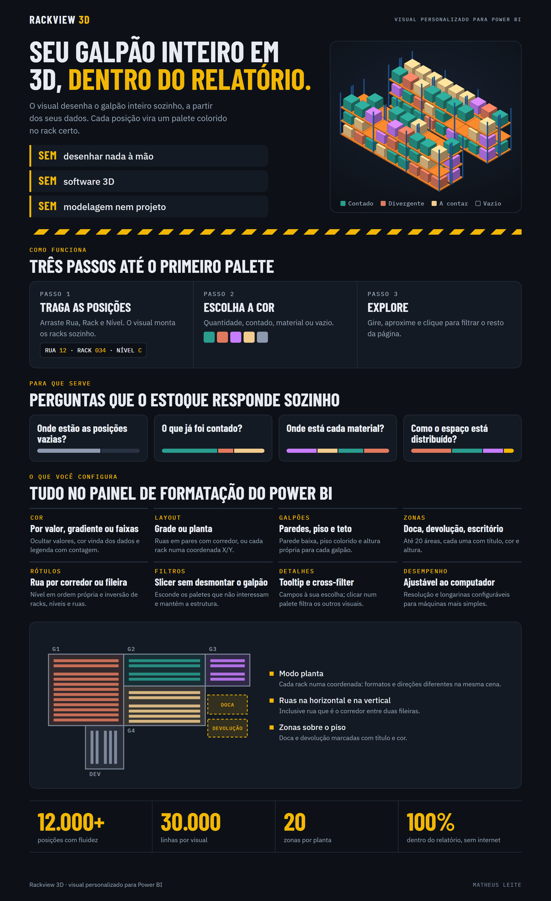
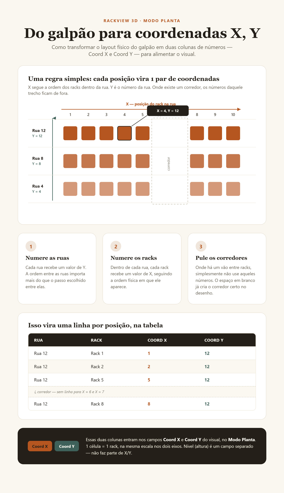

# Rackview 3D

Visual 3D de racks para o Power BI. Cada posição de estoque vira um palete colorido dentro da
estrutura do rack — sem modelar nada em outro programa, sem exportar arquivo 3D. Você informa a
posição de cada palete (rua, rack e nível, ou a coordenada de cada rack) e o visual desenha o
galpão sozinho.

## O que dá pra fazer

- Ver as posições vazias e as divergências de contagem no lugar onde elas realmente ficam no
  galpão, não só numa tabela.
- Pintar os paletes por qualquer campo: quantidade, curva ABC, status de contagem, material...
- Filtrar pelo relatório sem a estrutura do galpão desaparecer.
- Navegar em 3D: girar, aproximar, afastar, clicar para selecionar.
- Funciona com galpões retos (rua/rack/nível) ou com formatos irregulares (coordenadas).

## Como usar

1. **Monte uma tabela com uma linha por posição** (rua + rack + nível), incluindo as posições
   vazias — o visual só desenha o que chega na tabela.
2. **Arraste os campos** para o visual: Rua, Rack e Nível são os únicos obrigatórios. Os demais
   (cor, tooltip, filtro) são opcionais.
3. **Pronto** — o visual monta o galpão sozinho. Gire com o botão esquerdo do mouse, use a roda
   para aproximar/afastar e passe o mouse sobre um palete para ver os detalhes.

Isso já cobre a maioria dos casos. Para galpões com formato irregular (corredores em ângulo,
blocos fora do padrão), existe o **modo Planta**: em vez de rua/rack/nível, cada rack recebe uma
coordenada X e Y, como neste esquema:

A ideia em três passos:

1. Cada **rua** recebe um número de Y.
2. Cada **rack**, dentro da rua, recebe um número de X.
3. Onde existe um **corredor**, simplesmente não se usa aqueles números — o espaço em branco já
   abre o vão certo no desenho.

## Guia completo

O passo a passo com todas as opções (cores, zonas, galpões, filtros, atalhos de navegação) está em
[`docs/guia-de-uso.md`](guia-de-uso.md).
